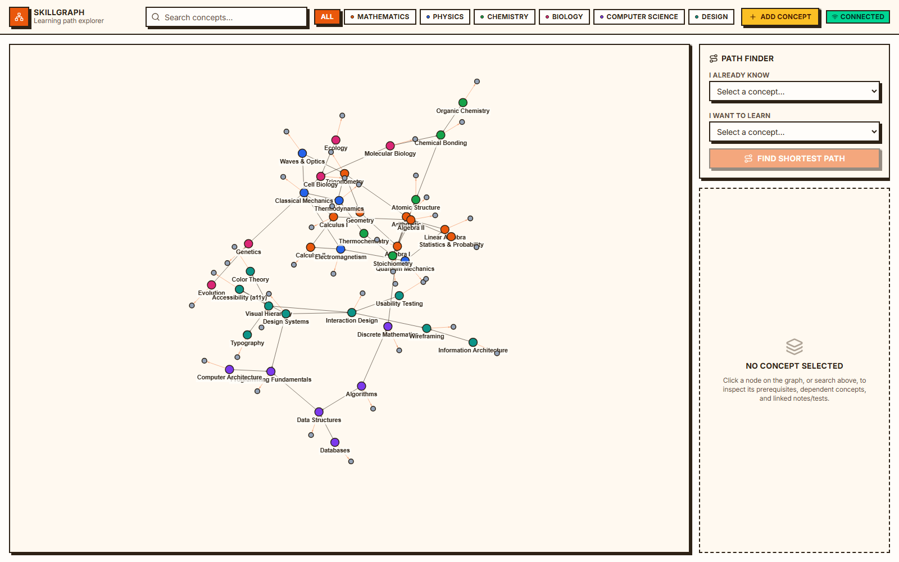
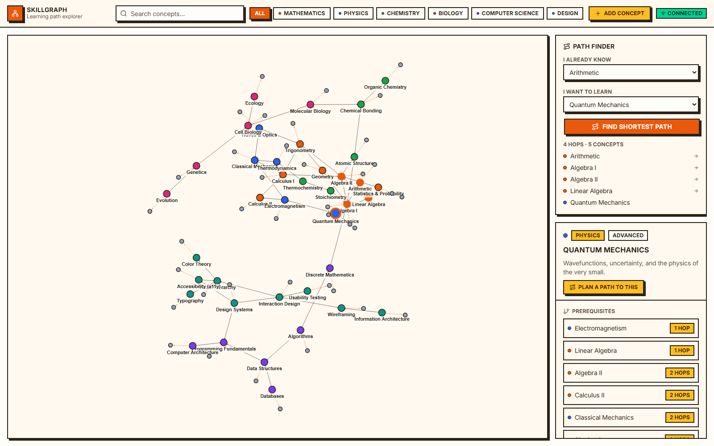
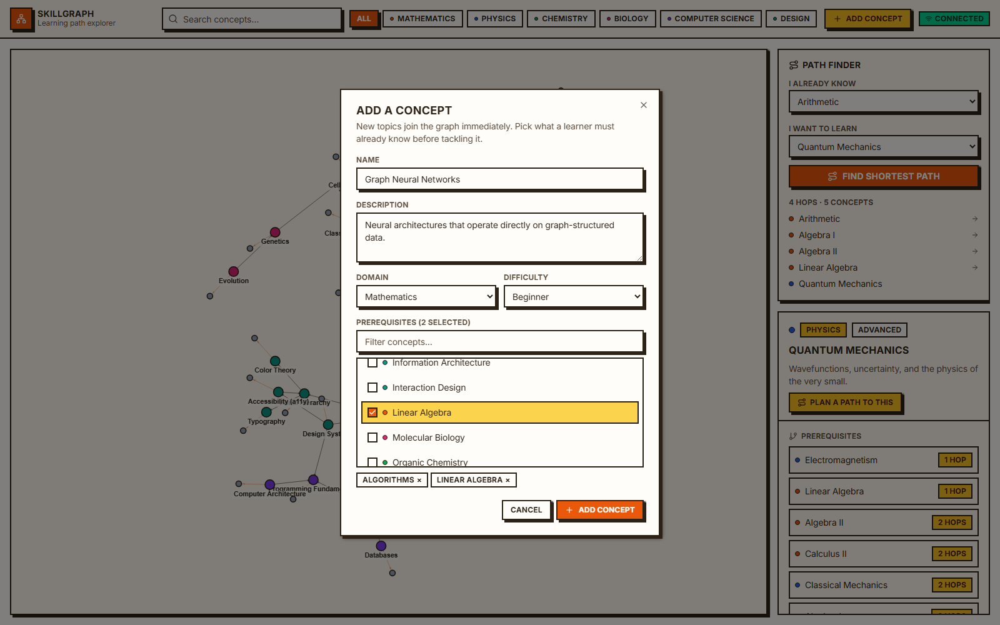
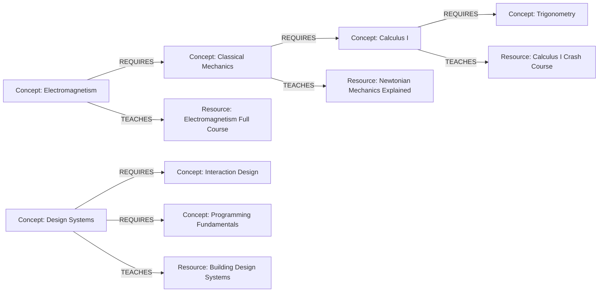

# SkillGraph

An interactive prerequisite explorer for learning concepts across STEM and UI/UX design, built on a real graph database. Search for a concept, inspect its direct and indirect prerequisites, browse the notes and tests that teach it, and work out the shortest learning path between any two topics. Every question is answered by an openCypher traversal against **CognoDB**.

**Live demo:** https://skillgraph-frontend.pages.dev
**API:** https://skillgraph-backend.zaidansari2249.workers.dev/api/health

```
skillgraph/
├── backend/    Hono.js API on Cloudflare Workers, talking to CognoDB via neo4j-driver
├── frontend/   React + Vite + Tailwind v4 + shadcn/ui, graph rendered with react-force-graph-2d
└── README.md   You are here
```

---

## Screenshots

The full graph. Concepts are coloured by domain, grey nodes are attached notes and tests, and arrows point from a concept to what it requires.



Picking a start and a goal runs a `shortestPath` traversal and returns the study order. The inspector on the right lists every prerequisite with its hop distance.



Concepts can be added from the UI, with prerequisites wired up at the same time.



---

## Why a Graph Database?

A prerequisite curriculum is relationships all the way down. Quantum Mechanics requires Electromagnetism, which requires Classical Mechanics, which requires Calculus I, and any of those might also be taught by several different notes or tests. In a relational schema that becomes a self-referencing `prerequisites` join table, and the questions people actually want to ask (*what does a learner need before Quantum Mechanics?*, *what is the shortest route from Arithmetic to Algorithms?*) turn into recursive CTEs with hand-rolled cycle guards, or an application-layer BFS firing one query per level.

In a graph database, those questions are native primitives:

| Question | SQL | Cypher |
|---|---|---|
| Direct prerequisites | `SELECT ... WHERE concept_id = ?` | `MATCH (c)-[:REQUIRES]->(p)` |
| Multi-tier prerequisites (2–4 hops) | Recursive CTE + depth tracking | `MATCH (c)-[:REQUIRES*1..4]->(p)` |
| Shortest learning path between two arbitrary concepts | Recursive CTE + manual shortest-path bookkeeping, or Dijkstra in app code | `MATCH p = shortestPath((a)-[:REQUIRES*..10]->(b))` |

The `REQUIRES` relationship is first-class, typed, and traversable in either direction without a join, which is exactly the shape of a prerequisite curriculum. CognoDB provides that model as a managed, Bolt-compatible service, so the existing Neo4j driver and Cypher ecosystem works unchanged.

---

## Schema

```
      REQUIRES
   ┌────────────────────┐
   │                     ▼
┌──────────┐       ┌──────────┐
│ Concept  │──────▶│ Concept  │   (a concept requires its prerequisite)
│(advanced)│       │(prereq)  │
└────┬─────┘       └──────────┘
     │ TEACHES
     ▼
┌──────────┐
│ Resource │   (note, test, article, video, or course)
└──────────┘
```



**Node labels**
- `Concept {id, name, description, domain, difficulty}` is a learnable topic. `domain` is one of Mathematics, Physics, Chemistry, Biology, Computer Science, or Design.
- `Resource {id, title, url, type}` is a note, test, article, video, or course that teaches a concept.

**Relationships**
- `(:Concept)-[:REQUIRES]->(:Concept)`: the source concept requires the target as a prerequisite.
- `(:Concept)-[:TEACHES]->(:Resource)`: the resource teaches this concept.

The seed dataset ships **39 Concepts** and **39 Resources** across six domains (Mathematics, Physics, Chemistry, Biology, Computer Science, and Design/UI-UX), with **46 `REQUIRES`** and **39 `TEACHES`** relationships (85 total), and prerequisite chains up to 6 hops deep, which gives the multi-hop and shortest-path queries something real to work with. The Design domain (Typography, Color Theory, Visual Hierarchy, Accessibility, Wireframing, Information Architecture, Interaction Design, Usability Testing, Design Systems) forms its own prerequisite tree and touches Computer Science via `Design Systems REQUIRES Programming Fundamentals`. Note that Programming Fundamentals is itself a root with no prerequisites, so there is deliberately **no** path from the Design tree down into Mathematics. That makes it a useful case for exercising the "no path found" state (`design-systems` → `arithmetic` correctly returns 404). For a deep path that does exist, try `quantum-mechanics` → `arithmetic` (4 hops, crossing Physics into Mathematics).

---

## Cypher Query Breakdown

Everything is passed as a Cypher parameter (`$conceptId`, `$sourceId`, ...) rather than interpolated into the query string. The one exception is the hop count in variable-length patterns (`*1..N`), which Cypher has no syntax to parameterize. That value is validated and clamped server-side by `clampHops` in `routes/concepts.ts` before it reaches a query, so it is never attacker-controlled.

**1. Single-hop concept detail**
```cypher
MATCH (c:Concept {id: $conceptId}) RETURN c LIMIT 1
```

**2. Multi-hop prerequisite tree (2+ hops).** Everything a learner ultimately needs before this concept, tagged with how many hops away it is:
```cypher
MATCH path = (c:Concept {id: $conceptId})-[:REQUIRES*1..4]->(prereq:Concept)
RETURN prereq, min(length(path)) AS hopDistance
ORDER BY hopDistance ASC, prereq.name ASC
```

**3. Shortest learning path (graph-native, awkward in SQL).** The minimal sequence of concepts connecting any two nodes, returned in study order.

`REQUIRES` points from an advanced concept down to its prerequisite, so a learner's forward journey runs *against* the arrows. We traverse from the goal back to what they already know and reverse the result:

```cypher
MATCH (start:Concept {id: $sourceId}), (target:Concept {id: $targetId})
MATCH p = shortestPath((target)-[:REQUIRES*..10]->(start))
RETURN [n IN reverse(nodes(p)) | n] AS pathNodes
```

**3b. Cycle guard on new prerequisite links (also awkward in SQL).** Before linking two existing concepts we check whether the prerequisite can already reach the concept, which would make the curriculum circular and unlearnable:

```cypher
MATCH (prereq:Concept {id: $prereqId})
OPTIONAL MATCH path = (prereq)-[:REQUIRES*1..]->(concept:Concept {id: $conceptId})
RETURN count(path) > 0 AS wouldCycle
```

The natural way to write that is `EXISTS((prereq)-[:REQUIRES*]->(concept))`, but on CognoDB 0.9.x `EXISTS()` ignores the already-bound endpoints and returns true whenever *any* `REQUIRES` path exists anywhere in the graph, which rejects every legitimate link. Both `EXISTS(pattern)` and the `EXISTS { ... }` subquery form behave that way, so this uses `OPTIONAL MATCH` + `count()` instead.

**4. Full graph overview.** Powers the interactive canvas:
```cypher
MATCH (n:Concept)
OPTIONAL MATCH (n)-[r:REQUIRES]->(m:Concept)
RETURN n, r, m
LIMIT 200
```

**5. Resources for a concept**
```cypher
MATCH (c:Concept {id: $conceptId})-[:TEACHES]->(res:Resource)
RETURN res
```

See [`backend/src/db/queries.ts`](backend/src/db/queries.ts) for the complete, typed query library.

---

## API Reference

| Route | Description |
|---|---|
| `GET /api/health` | Connectivity probe used for the frontend's status banner. |
| `GET /api/graph/overview` | Full node/edge dump for the graph canvas. |
| `GET /api/concepts?domain=&q=` | List/search concepts, optionally filtered by domain or free-text query. |
| `GET /api/concepts/:id` | Single-hop concept detail. |
| `GET /api/concepts/:id/prerequisites?hops=4` | Multi-hop prerequisite tree. |
| `GET /api/concepts/:id/unlocks?hops=4` | Multi-hop reverse traversal: concepts that depend on this one. |
| `GET /api/concepts/:id/resources` | Notes/tests linked to a concept. |
| `GET /api/paths/shortest?source=&target=` | Shortest `REQUIRES` path between two concepts. |
| `POST /api/concepts` | Create a concept, optionally with prerequisites. |
| `POST /api/concepts/:id/prerequisites` | Link an existing concept to a prerequisite. |
| `POST /api/concepts/:id/resources` | Attach a note, test, article, video or course. |

Writes are validated server-side before they touch the graph: field lengths and
enums are checked, duplicate slugs return `409 ALREADY_EXISTS`, unknown
prerequisite ids are rejected rather than silently dropped, and any link that
would close a prerequisite loop returns `409 WOULD_CREATE_CYCLE`.

Every route that touches CognoDB is wrapped so a connectivity failure returns:
```json
{ "error": "DATABASE_UNAVAILABLE", "message": "CognoDB is unreachable right now. ..." }
```
with **HTTP 503**, which the frontend recognizes and renders as a recovery banner instead of crashing (see `App.tsx` + `db/driver.ts`'s `DatabaseUnavailableError`).

---

## Creating a Free (c0) CognoDB Instance

1. Sign up / log in at your CognoDB Cloud console.
2. Click **New Instance** → choose the **c0 (free)** tier.
3. Pick a region close to where your Worker will run, name the instance (e.g. `skillgraph`), and create it.
4. Once provisioned, open the instance's **Connection** tab and copy:
   - the **Bolt URI** (looks like `bolt+s://<instance-id>.<region>.cognodb.cloud:7687` or a similar managed hostname),
   - the **username** (commonly `neo4j`),
   - the **password** (shown once at creation, so store it now).
5. These three values are exactly `COGNODB_URI`, `COGNODB_USER`, and `COGNODB_PASSWORD` used below. Free-tier instances typically auto-pause after a period of inactivity. The app's `/api/health` banner will tell you if that has happened; just reopen the instance from the console to resume it.

---

## Local Setup

### Prerequisites
- Node.js 18+
- A CognoDB Cloud instance (see above)

### 1. Backend

```bash
cd backend
npm install   # also runs the postinstall patch, see the Workers section below

# Local dev secrets (gitignored)
cp .dev.vars.example .dev.vars
# edit .dev.vars with your COGNODB_URI / COGNODB_USER / COGNODB_PASSWORD

# Also needed for the seed script (plain Node, not the Worker runtime)
cp .env.example .env
# edit .env the same way

npm run seed      # populate CognoDB with the sample concept graph
npm run dev        # wrangler dev, serves the API on http://127.0.0.1:8787
```

### 2. Frontend

```bash
cd frontend
npm install
npm run dev         # http://localhost:5173, proxies /api to the Worker in dev
```

Open http://localhost:5173. You should see the graph populate, a connection status pill in the top bar, and be able to click nodes, search, filter by domain, and run the path finder.

---

## Running `neo4j-driver` on Cloudflare Workers

Getting the official driver to speak `bolt+s://` from a Worker takes **three** things. Miss any one and every query fails, each with a different and fairly misleading error. All three are already configured in this repo; this section exists so the reasoning isn't lost.

**1. `nodejs_compat` + a recent `compatibility_date`.** The flag alone isn't enough. `wrangler.toml` pins `compatibility_date = "2026-08-01"`; on an older date (we started on `2024-11-01`) the runtime ships a thinner `node:tls`, and the driver's TLS handshake simply hangs until it hits `connectionTimeout`. That surfaces as `Failed to establish connection in 10000ms`, which looks exactly like a firewall block and will send you hunting through your database's IP allowlist for no reason.

**2. Drop the `"browser"` field remap.** `neo4j-driver` and `neo4j-driver-bolt-connection` each ship a `package.json` `"browser"` field that swaps their raw-socket **Node channel** for a **WebSocket channel** intended for real browsers. Wrangler bundles Workers in browser-platform mode, so it honors that remap and the Worker tries to speak Bolt-over-WebSocket, which CognoDB, like virtually every Bolt server, doesn't support. Symptom: `WebSocket connection failure`.

**3. Strip `rejectUnauthorized` from the driver's TLS options.** With the Node channel restored, the driver builds its `tls.connect()` options with a hardcoded `rejectUnauthorized: false`. Workers' `node:tls` doesn't implement that option and throws `ERR_OPTION_NOT_IMPLEMENTED`. Removing it is also a security *improvement*: rather than the driver's "skip certificate verification", the connection falls back to the Workers runtime's default TLS behaviour, which does verify the server certificate against public CAs.

Items 2 and 3 are applied by [`backend/scripts/patch-neo4j-driver.cjs`](backend/scripts/patch-neo4j-driver.cjs), which runs automatically via `postinstall`, so a plain `npm install` is all you need, including on Cloudflare's own build pipeline. Both patches are idempotent, and the script fails loudly if the driver's internals change shape rather than silently shipping a Worker that can't connect.

> **Debugging tip.** If connections fail, first determine whether it's the network or the driver. A few lines using `connect()` from `cloudflare:sockets` to your host on port 7687, once with `secureTransport: "off"` and once with `"on"`, will tell you in seconds. If both succeed, the network path is fine and the problem is in the driver/runtime layer, so don't go changing firewall rules.

---

## Cloudflare Deployment

### Backend → Cloudflare Workers

```bash
cd backend
npx wrangler login
wrangler secret put COGNODB_URI
wrangler secret put COGNODB_USER
wrangler secret put COGNODB_PASSWORD
npm run deploy
```

This publishes to `https://skillgraph-backend.<your-subdomain>.workers.dev`. `wrangler.toml` already sets `compatibility_flags = ["nodejs_compat"]`, which `neo4j-driver` needs to run in the Workers runtime (see the section above; `npm install` must run at least once so the `postinstall` patch has applied before `wrangler deploy` bundles the code).

### Frontend → Cloudflare Pages (or Vercel)

```bash
cd frontend
# point the deployed frontend at your live Worker:
echo "VITE_API_BASE_URL=https://skillgraph-backend.<your-subdomain>.workers.dev" > .env.production
npm run build
npx wrangler pages deploy dist --project-name skillgraph-frontend
```

Or on Vercel: import the `frontend/` directory as a Vite project, set `VITE_API_BASE_URL` in the project's environment variables, and deploy. No other config needed.

Remember to tighten the CORS `origin: "*"` in `backend/src/index.ts` to your deployed frontend's exact origin once you have it.

---

## Frontend Tour

- **Top bar**: search with autocomplete, domain filter pills, and a live connection status indicator (checking / connected / offline, polled every 15s via `/api/health`).
- **Center canvas** (`GraphCanvas.tsx`): force-directed graph, Concept nodes colored by domain, Resource nodes muted, directed arrows for `REQUIRES` edges, click any node to inspect it, selected/path nodes get a highlighted ring.
- **Path Finder** (`PathFinder.tsx`): pick a source and target concept, get the shortest `REQUIRES` path with hop count; the path also highlights on the canvas.
- **Concept Inspector** (`ConceptDrawer.tsx`): direct + indirect prerequisites (with hop distance), concepts this one unlocks, and linked notes/tests; loading skeletons and empty/error states throughout.

The UI is a **neobrutalist** theme: zero border radius, thick 2px dark borders, and hard 4px offset drop-shadows (no blur) that flatten to nothing on press/hover for a tactile, physical feel. See the button, card, and badge components under `frontend/src/components/ui/`. The whole palette (`frontend/src/index.css`) is a fixed set of CSS custom properties consumed by Tailwind v4's `@theme inline`. Light and dark variants are both defined there, so don't hand-edit the hex values, shadows, or radius tokens without updating both.

---

## Tech Stack

- **Frontend**: React 18 + Vite + TypeScript, Tailwind CSS v4, shadcn/ui-style components, Lucide icons, `react-force-graph-2d`.
- **Backend**: Hono.js on Cloudflare Workers.
- **Database**: CognoDB Cloud (openCypher over Bolt 5.0–5.4) via the official `neo4j-driver`.
- **Tooling**: Wrangler, Vite, tsx (seed script runner).
