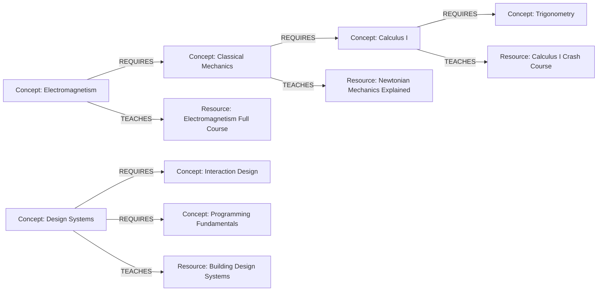

# SkillGraph

An interactive prerequisite explorer for learning concepts — spanning STEM and UI/UX design — built on a real graph database. Search for a concept, inspect its direct and indirect prerequisites, browse the notes/tests that teach it, and compute the shortest learning path between any two topics — all backed by openCypher traversals over **CognoDB**.

```
skillgraph/
├── backend/    Hono.js API on Cloudflare Workers, talking to CognoDB via neo4j-driver
├── frontend/   React + Vite + Tailwind v4 + shadcn/ui, graph rendered with react-force-graph-2d
└── README.md   You are here
```

---

## Why a Graph Database?

A prerequisite curriculum is *relationships all the way down* — "Quantum Mechanics" requires "Electromagnetism" which requires "Classical Mechanics" which requires "Calculus I," and any of those concepts might also be taught by several different notes or tests. In a relational schema this becomes a self-referencing `prerequisites` join table, and every interesting question — *"what does a learner need before Quantum Mechanics?"*, *"what's the shortest path from Arithmetic to Algorithms?"* — turns into a recursive CTE with manual cycle-guarding, or an application-layer BFS over rows fetched one query at a time.

In a graph database, those questions are native primitives:

| Question | SQL | Cypher |
|---|---|---|
| Direct prerequisites | `SELECT ... WHERE concept_id = ?` | `MATCH (c)-[:REQUIRES]->(p)` |
| Multi-tier prerequisites (2–4 hops) | Recursive CTE + depth tracking | `MATCH (c)-[:REQUIRES*1..4]->(p)` |
| Shortest learning path between two arbitrary concepts | Recursive CTE + manual shortest-path bookkeeping, or Dijkstra in app code | `MATCH p = shortestPath((a)-[:REQUIRES*..10]->(b))` |

The `REQUIRES` relationship is first-class, typed, and traversable in either direction without a join — exactly the shape of a prerequisite curriculum. CognoDB gives us that model as a managed, Bolt-compatible service, so the existing Neo4j driver and Cypher ecosystem just works.

---

## Schema

```
      REQUIRES
   ┌────────────────────┐
   │                     ▼
┌──────────┐       ┌──────────┐
│ Concept  │──────▶│ Concept  │   (a concept requires its prerequisite)
│(advanced)│       │(prereq)  │
└────┬─────┘       └──────────┘
     │ TEACHES
     ▼
┌──────────┐
│ Resource │   (note, test, article, video, or course)
└──────────┘
```



**Node labels**
- `Concept {id, name, description, domain, difficulty}` — a learnable topic. `domain` is one of Mathematics, Physics, Chemistry, Biology, Computer Science, or Design.
- `Resource {id, title, url, type}` — a note, test, article, video, or course that teaches a concept.

**Relationships**
- `(:Concept)-[:REQUIRES]->(:Concept)` — the source concept requires the target as a prerequisite.
- `(:Concept)-[:TEACHES]->(:Resource)` — the resource teaches this concept.

The seed dataset ships **39 Concepts** and **39 Resources** across six domains (Mathematics, Physics, Chemistry, Biology, Computer Science, and Design/UI-UX), with **46 `REQUIRES`** and **39 `TEACHES`** relationships (85 total), and prerequisite chains up to 6 hops deep — deep enough to meaningfully exercise multi-hop traversal and shortest-path queries. The Design domain (Typography, Color Theory, Visual Hierarchy, Accessibility, Wireframing, Information Architecture, Interaction Design, Usability Testing, Design Systems) is mostly self-contained but bridges into Computer Science via `Design Systems REQUIRES Programming Fundamentals` — try a shortest-path query from `arithmetic` to `design-systems` to see a cross-domain path.

---

## Cypher Query Breakdown

All queries are parameterized (`$conceptId`, `$sourceId`, …) — never string-interpolated — except hop counts in variable-length patterns (`*1..N`), which Cypher has no syntax to parameterize; the API layer validates and clamps that value server-side (`clampHops` in `routes/concepts.ts`) before it's ever interpolated, so it's never attacker-controlled.

**1. Single-hop concept detail**
```cypher
MATCH (c:Concept {id: $conceptId}) RETURN c LIMIT 1
```

**2. Multi-hop prerequisite tree (2+ hops)** — everything a learner ultimately needs before this concept, tagged with hop distance:
```cypher
MATCH path = (c:Concept {id: $conceptId})-[:REQUIRES*1..4]->(prereq:Concept)
RETURN prereq, min(length(path)) AS hopDistance
ORDER BY hopDistance ASC, prereq.name ASC
```

**3. Shortest learning path (graph-native, awkward in SQL)** — the minimal sequence of concepts connecting any two arbitrary nodes:
```cypher
MATCH (start:Concept {id: $sourceId}), (target:Concept {id: $targetId})
MATCH p = shortestPath((start)-[:REQUIRES*..10]->(target))
RETURN [n IN nodes(p) | n] AS pathNodes
```

**4. Full graph overview** — powers the interactive canvas:
```cypher
MATCH (n:Concept)
OPTIONAL MATCH (n)-[r:REQUIRES]->(m:Concept)
RETURN n, r, m
LIMIT 200
```

**5. Resources for a concept**
```cypher
MATCH (c:Concept {id: $conceptId})-[:TEACHES]->(res:Resource)
RETURN res
```

See [`backend/src/db/queries.ts`](backend/src/db/queries.ts) for the complete, typed query library.

---

## API Reference

| Route | Description |
|---|---|
| `GET /api/health` | Connectivity probe used for the frontend's status banner. |
| `GET /api/graph/overview` | Full node/edge dump for the graph canvas. |
| `GET /api/concepts?domain=&q=` | List/search concepts, optionally filtered by domain or free-text query. |
| `GET /api/concepts/:id` | Single-hop concept detail. |
| `GET /api/concepts/:id/prerequisites?hops=4` | Multi-hop prerequisite tree. |
| `GET /api/concepts/:id/unlocks?hops=4` | Multi-hop reverse traversal — concepts that depend on this one. |
| `GET /api/concepts/:id/resources` | Notes/tests linked to a concept. |
| `GET /api/paths/shortest?source=&target=` | Shortest `REQUIRES` path between two concepts. |

Every route that touches CognoDB is wrapped so a connectivity failure returns:
```json
{ "error": "DATABASE_UNAVAILABLE", "message": "CognoDB is unreachable right now. ..." }
```
with **HTTP 503**, which the frontend recognizes and renders as a recovery banner instead of crashing (see `App.tsx` + `db/driver.ts`'s `DatabaseUnavailableError`).

---

## Creating a Free (c0) CognoDB Instance

1. Sign up / log in at your CognoDB Cloud console.
2. Click **New Instance** → choose the **c0 (free)** tier.
3. Pick a region close to where your Worker will run, name the instance (e.g. `skillgraph`), and create it.
4. Once provisioned, open the instance's **Connection** tab and copy:
   - the **Bolt URI** (looks like `bolt+s://<instance-id>.<region>.cognodb.cloud:7687` or a similar managed hostname),
   - the **username** (commonly `neo4j`),
   - the **password** (shown once at creation — store it now).
5. These three values are exactly `COGNODB_URI`, `COGNODB_USER`, and `COGNODB_PASSWORD` used below. Free-tier instances typically auto-pause after a period of inactivity — the app's `/api/health` banner will tell you if that's happened; just reopen the instance from the console to resume it.

---

## Local Setup

### Prerequisites
- Node.js 18+
- A CognoDB Cloud instance (see above)

### 1. Backend

```bash
cd backend
npm install   # also runs postinstall patch — see "Cloudflare Workers gotcha" below

# Local dev secrets (gitignored)
cp .dev.vars.example .dev.vars
# edit .dev.vars with your COGNODB_URI / COGNODB_USER / COGNODB_PASSWORD

# Also needed for the seed script (plain Node, not the Worker runtime)
cp .env.example .env
# edit .env the same way

npm run seed      # populate CognoDB with the sample concept graph
npm run dev        # wrangler dev — starts the API on http://127.0.0.1:8787
```

### 2. Frontend

```bash
cd frontend
npm install
npm run dev         # http://localhost:5173, proxies /api to the Worker in dev
```

Open http://localhost:5173 — you should see the graph populate, a connection status pill in the top bar, and be able to click nodes, search, filter by domain, and run the path finder.

---

## Cloudflare Workers gotcha: `neo4j-driver`'s browser channel

`neo4j-driver` (via `neo4j-driver-bolt-connection`) ships a `package.json` `"browser"` field that swaps its raw-socket **Node channel** for a **WebSocket channel** meant for actual web browsers. Wrangler bundles Workers in browser-platform mode by default, so without a fix, `npm run dev` / a deployed Worker will silently try to speak Bolt-over-WebSocket — which CognoDB (like virtually every Bolt server) doesn't support — and every query fails with a `WebSocket connection failure` error.

`compatibility_flags = ["nodejs_compat"]` in `wrangler.toml` gives the Worker a real `node:net` / `node:tls` (backed by the Workers TCP `connect()` API), so the Node channel actually works here — the driver just needs to be told to use it. [`backend/scripts/patch-neo4j-driver.cjs`](backend/scripts/patch-neo4j-driver.cjs) removes the `"browser"` field from both packages' `package.json`, restoring the Node channel; it runs automatically via `postinstall`, so a plain `npm install` is all you need — no manual step required, and it's safe to re-run.

---

## Cloudflare Deployment

### Backend → Cloudflare Workers

```bash
cd backend
npx wrangler login
wrangler secret put COGNODB_URI
wrangler secret put COGNODB_USER
wrangler secret put COGNODB_PASSWORD
npm run deploy
```

This publishes to `https://skillgraph-backend.<your-subdomain>.workers.dev`. `wrangler.toml` already sets `compatibility_flags = ["nodejs_compat"]`, which `neo4j-driver` needs to run in the Workers runtime (see the gotcha above — `npm install` must run at least once so the `postinstall` patch has applied before `wrangler deploy` bundles the code).

### Frontend → Cloudflare Pages (or Vercel)

```bash
cd frontend
# point the deployed frontend at your live Worker:
echo "VITE_API_BASE_URL=https://skillgraph-backend.<your-subdomain>.workers.dev" > .env.production
npm run build
npx wrangler pages deploy dist --project-name skillgraph-frontend
```

Or on Vercel: import the `frontend/` directory as a Vite project, set `VITE_API_BASE_URL` in the project's environment variables, and deploy — no other config needed.

Remember to tighten the CORS `origin: "*"` in `backend/src/index.ts` to your deployed frontend's exact origin once you have it.

---

## Frontend Tour

- **Top bar** — search with autocomplete, domain filter pills, and a live connection status indicator (checking / connected / offline, polled every 15s via `/api/health`).
- **Center canvas** (`GraphCanvas.tsx`) — force-directed graph, Concept nodes colored by domain, Resource nodes muted, directed arrows for `REQUIRES` edges, click any node to inspect it, selected/path nodes get a highlighted ring.
- **Path Finder** (`PathFinder.tsx`) — pick a source and target concept, get the shortest `REQUIRES` path with hop count; the path also highlights on the canvas.
- **Concept Inspector** (`ConceptDrawer.tsx`) — direct + indirect prerequisites (with hop distance), concepts this one unlocks, and linked notes/tests; loading skeletons and empty/error states throughout.

The UI is a **neobrutalist** theme: zero border radius, thick 2px dark borders, and hard 4px offset drop-shadows (no blur) that flatten to nothing on press/hover for a tactile, physical feel — see the button, card, and badge components under `frontend/src/components/ui/`. The whole palette (`frontend/src/index.css`) is a fixed set of CSS custom properties consumed by Tailwind v4's `@theme inline` — light and dark variants are both defined there; don't hand-edit the hex values, shadows, or radius tokens without updating both.

---

## Tech Stack

- **Frontend**: React 18 + Vite + TypeScript, Tailwind CSS v4, shadcn/ui-style components, Lucide icons, `react-force-graph-2d`.
- **Backend**: Hono.js on Cloudflare Workers.
- **Database**: CognoDB Cloud (openCypher over Bolt 5.0–5.4) via the official `neo4j-driver`.
- **Tooling**: Wrangler, Vite, tsx (seed script runner).
